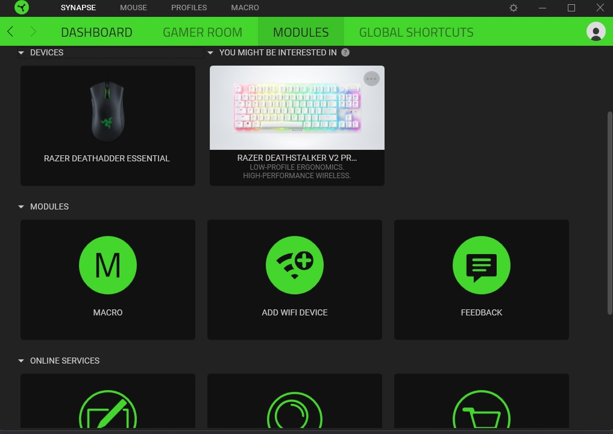
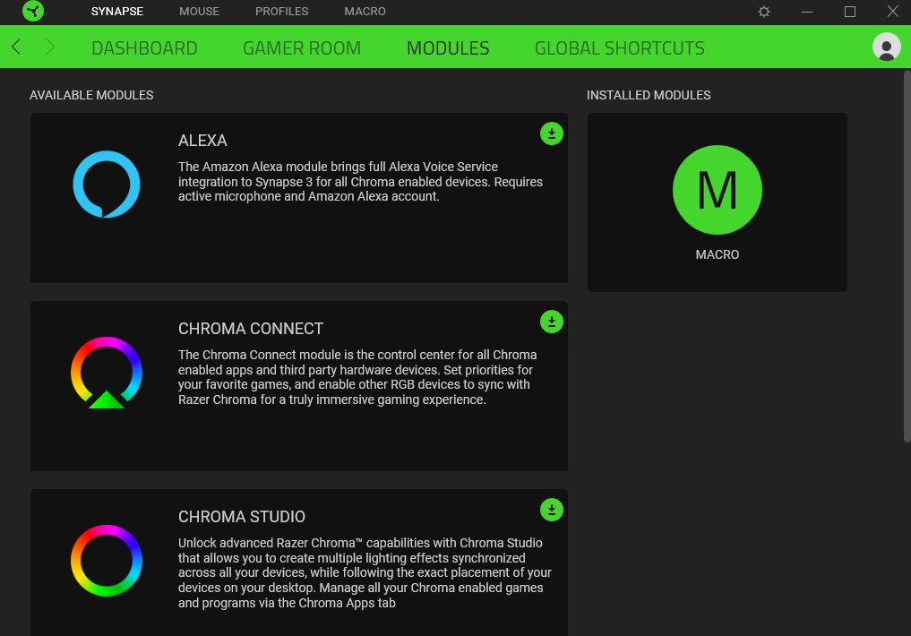
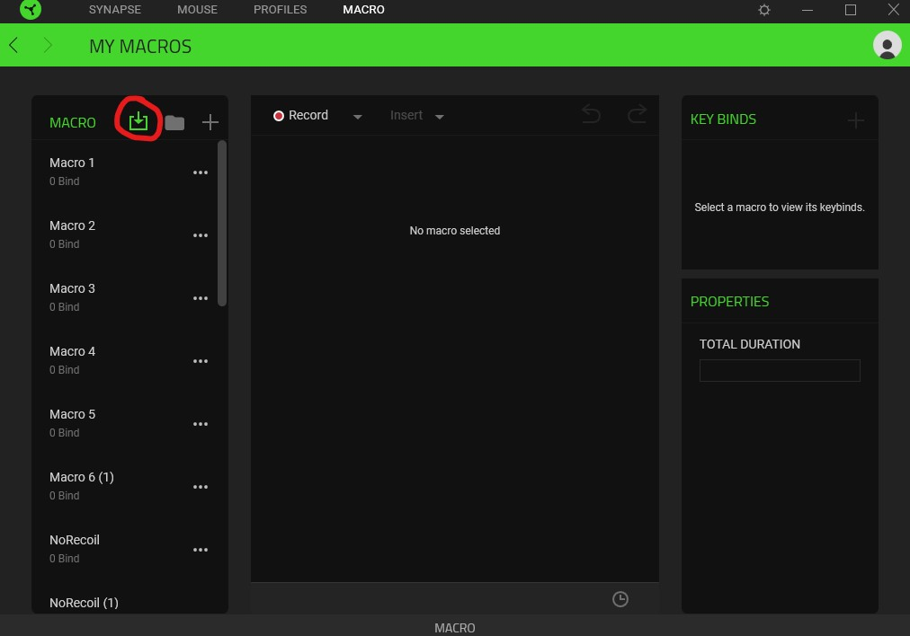
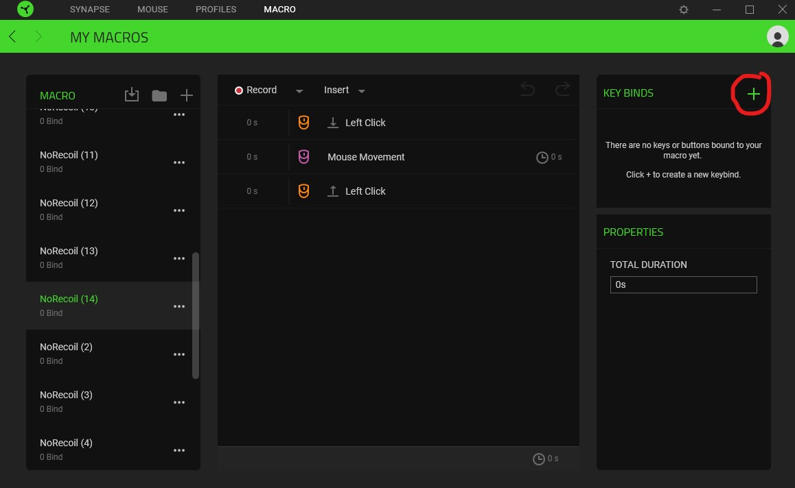
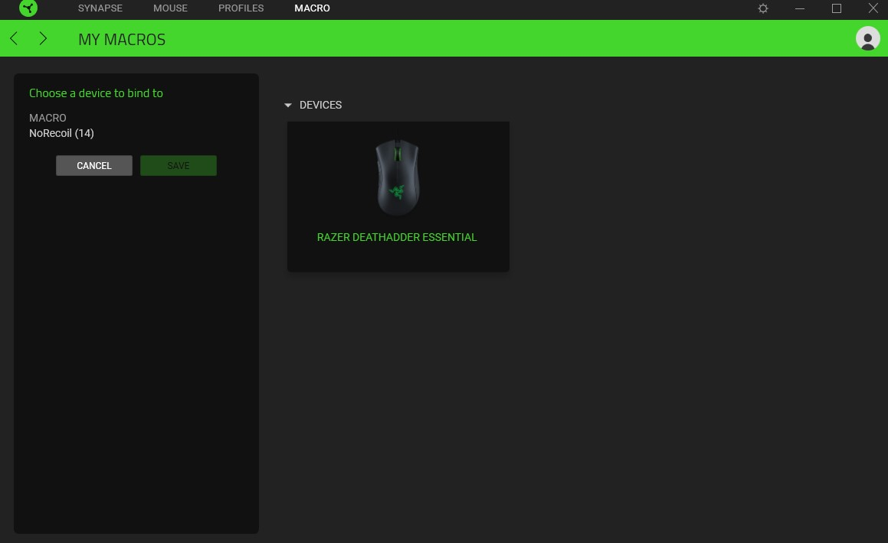
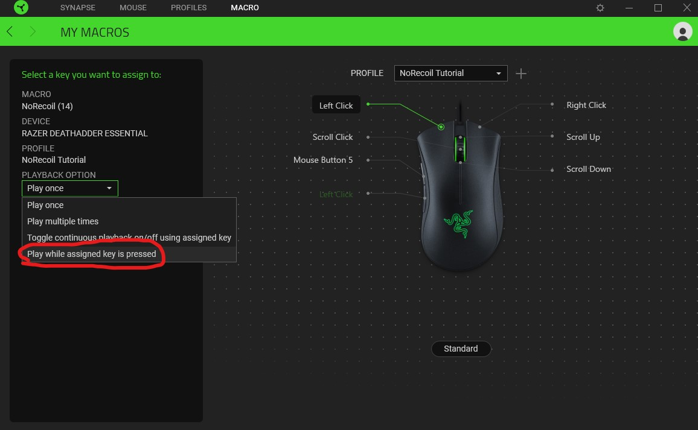

# R6AntiRecoil
Anti Recoil script for Rainbow Six Seige Using Razer Synapse
### Use at your own risk

---

## Prerequisites:

- A Razer-branded mouse  
- [Razer Synapse 3 Software](https://www.razer.com/gb-en/synapse-3)  

---

## Setup:

### 1. Create a new profile for your mouse  
Assign "left mouse click" to another button either on your mouse or on a Razer keyboard if you have one.  

### 2. Install the Macros Module  
Go to the "Modules" tab on the top banner, then install the "Macros" module by finding and selecting it.  

### 3. Import the Macro  
Click the import button highlighted below and select the `QuirkyAhhRecoil.xml` file.  

### 4. Open the Bind Menu  
Press the highlighted button to open the bind menu.  

### 5. Select Your Mouse  
Select the mouse you want to use the AntiRecoil on.  

### 6. Set the Macro  
Set the macro to the physical left mouse button and choose the playback option "Play while assigned key is pressed" as highlighted below.  

---

You can now enable the AntiRecoil anytime by selecting the profile that you have set up. Disable it by switching profiles again.  
Keep in mind that you will no longer be able to use your left mouse click button like normal until you switch profiles. I recommend changing it to scroll wheel down in **Step 1**.
I am not responsible for what you do with this script, use it at your own risk.
You risk your account getting banned if used in public matches.
Btw my sens is 5 on both axis.

